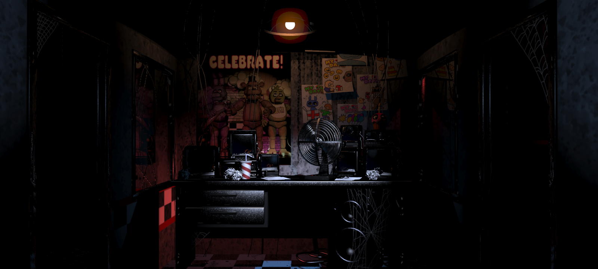

# EXAMEN PENSAMIENTO COMPUTACIONAL 

Sistema interactivo

### "Fnaf Simulación"

Autor: Sam Alexander Marquez Mejías

Curso: Pensamiento Computacional Sec 3 

## Descripción objetiva

Para este examen, al igual que en la solemne anterior, decidí mantener la línea de diseño enfocada en videojuegos. El proyecto se basa en el videojuego Five Nights at Freddy’s (FNAF), reinterpretando su estética y concepto de tensión en un entorno interactivo desarrollado en p5.js.

El trabajo consiste en una experiencia interactiva donde el usuario debe sobrevivir en un sistema de vigilancia y defensa, inspirado en la atmósfera del juego original, con el objetivo de generar tensión a través de la gestión de recursos y el tiempo.

## Inputs utilizados

Tecla A → abre/cierra puerta izquierda
Tecla D → abre/cierra puerta derecha
Tecla R → reiniciar el juego
Tecla ESPACIO → iniciar el juego desde el menú

## Outputs visuales 

 Fondo del escenario (fondo)
 Puertas (rectángulos semi transparentes)
 Barra de energía (rectángulo que cambia tamaño)
 Texto del HUD (hora, batería, controles)
 Texto de advertencia (enemigo cerca)
 Pantalla de Game Over (GIF jumpscare)
 Pantalla de victoria (imagen 6 AM)

 ## Outputs sonoros
 
 Sonido de jumpscare (fnaf.mp3)
 Sonido de victoria (yay.mp3)

## Procesos (lógica interna)

El sistema procesa constantemente la información dentro de draw() (≈60 veces por segundo):

- Se reduce la energía en cada frame
- Se actualiza el reloj del juego
- Se controla el avance del enemigo
- Se verifica el estado de las puertas
- Se calculan condiciones de victoria o derrota

Todo el sistema funciona en un bucle continuo de actualización.

## Estados del sistema

El juego se organiza mediante una variable de estado:

0 → menú
1 → juego activo
2 → game over (jumpscare)
3 → victoria

Esto permite separar las distintas pantallas del juego.

## Eventos

Los eventos principales del sistema son:

- Activación de teclas (keyPressed)
- Cambio de estado del enemigo (ataque)
- Consumo de batería
- Cambio de hora del juego
- Activación de victoria o derrota

Estos eventos modifican el comportamiento del sistema en tiempo real.

## Elementos multimedia

El proyecto utiliza:

Imágenes:
- fondo del escenario
- GIF de jumpscare
- imagen de victoria (6 AM)
 
Sonidos:
- sonido de jumpscare
- sonido de victoria

Estos refuerzan la atmósfera de tensión y recompensa. 

# Idea y proceso del proyecto

Al igual que en la solemne anterior, decidí mantener la línea de trabajo basada en la creación de un sistema interactivo inspirado en un videojuego. En este caso, quise enfocarme en un juego de terror, tomando como referencia Five Nights at Freddy’s (FNAF), con el objetivo de reinterpretar su sistema de tensión y supervivencia dentro de p5.js.

El principal interés del proyecto fue trasladar la experiencia del juego original, especialmente la sensación de vulnerabilidad constante, el uso de recursos limitados y la presión del tiempo. Para esto, se buscó mantener elementos característicos como la gestión de energía, el sistema de puertas y el jumpscare, incorporando además el sonido como parte fundamental de la inmersión, ya que refuerza la tensión y el impacto de los eventos dentro del juego.

Para la construcción del sistema se utilizaron distintas funciones que organizan la lógica del proyecto, como la función principal de actualización (draw()), encargada de mantener el sistema en ejecución constante, y funciones específicas para separar la lógica del juego, como el manejo de la energía, el comportamiento del enemigo, el sistema de reloj y la detección de eventos.

También se trabajó con variables que representan los estados del sistema, como la energía del jugador, el estado del juego (menú, juego, victoria o derrota) y el estado de las puertas. Estas variables permiten controlar el comportamiento general del sistema y su evolución en el tiempo.

El sistema de interacción se basa en eventos de teclado, los cuales permiten al jugador abrir y cerrar puertas, afectando directamente tanto la defensa frente al enemigo como el consumo de energía. Esto genera una dinámica de decisión constante entre protegerse o conservar recursos.

Por otro lado, el sistema de tiempo se implementa mediante el uso de frames dentro de draw(), lo que permite simular el paso del tiempo hasta llegar a la condición de victoria a las 6:00 AM. Este sistema refuerza la idea de supervivencia progresiva.

El enemigo se controla mediante una lógica basada en estados y aleatoriedad, utilizando un arreglo con dos posibles direcciones (izquierda y derecha) para determinar su aparición. Esto genera incertidumbre en el jugador y aumenta la tensión del sistema.

El momento del jumpscare se activa cuando el enemigo logra completar su ataque sin ser detenido, cambiando el estado del juego a derrota y activando elementos visuales y sonoros que refuerzan el impacto del evento.

Finalmente, el proyecto utiliza funciones auxiliares para estructurar la interfaz y los efectos visuales, incluyendo la representación de la batería, las puertas y los indicadores de estado, logrando un sistema modular donde cada función cumple un rol específico dentro del funcionamiento general del juego.

# Recursos visuales

## Fondo 

